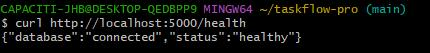
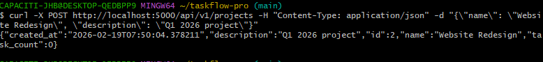
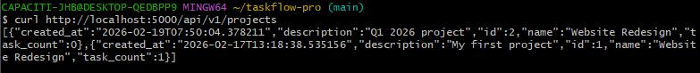
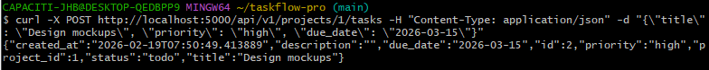
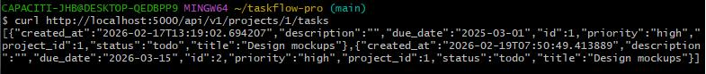

# TaskFlow Pro

> A production-grade, containerized task management REST API built with Flask, PostgreSQL, Docker, and AWS.

[](https://hub.docker.com/repository/docker/tayraps/taskflow-pro/general)
[](https://github.com/Trapholo01/taskflow-pro)

---

## 📋 Project Overview

TaskFlow Pro is a scalable, cloud-ready task management system designed to showcase modern DevOps and cloud engineering practices. This project demonstrates:

- **Production-grade application architecture** using Flask and PostgreSQL
- **Infrastructure as Code** with Terraform (Week 2)
- **CI/CD automation** with GitHub Actions (Week 3)
- **AWS cloud deployment** with auto-scaling and monitoring (Week 4)

---

## 🏗️ Architecture

**Week 1 — Local Development (Current)**
```
┌─────────────────────────────────────────┐
│   Docker Compose Environment            │
│                                          │
│  ┌──────────────┐      ┌──────────────┐ │
│  │  Flask App   │─────▶│  PostgreSQL  │ │
│  │  (Port 5000) │      │  (Port 5432) │ │
│  └──────────────┘      └──────────────┘ │
└─────────────────────────────────────────┘
```

**Week 2-4 — AWS Production (Coming)**
- Custom VPC with public/private subnets
- Application Load Balancer
- Auto Scaling Group (EC2)
- RDS PostgreSQL (Multi-AZ)
- CloudWatch monitoring

---

## 🛠️ Tech Stack

| Layer          | Technology                    |
|----------------|-------------------------------|
| Application    | Python 3.11, Flask            |
| Database       | PostgreSQL 15                 |
| Containerization | Docker, Docker Compose      |
| Image Registry | Docker Hub                    |
| IaC            | Terraform (Week 2)            |
| CI/CD          | GitHub Actions (Week 3)       |
| Cloud Provider | AWS (Week 2-4)                |
| Monitoring     | CloudWatch, Prometheus (Week 4) |

---

## 🚀 API Endpoints

### Health Check
| Method | Endpoint  | Description               |
|--------|-----------|---------------------------|
| GET    | `/health` | Health check (ALB ready)  |

### Projects
| Method | Endpoint              | Description          |
|--------|-----------------------|----------------------|
| GET    | `/api/v1/projects`    | List all projects    |
| POST   | `/api/v1/projects`    | Create project       |
| GET    | `/api/v1/projects/:id`| Get project by ID    |
| PUT    | `/api/v1/projects/:id`| Update project       |
| DELETE | `/api/v1/projects/:id`| Delete project       |

### Tasks
| Method | Endpoint                          | Description               |
|--------|-----------------------------------|---------------------------|
| GET    | `/api/v1/projects/:id/tasks`      | List tasks (with filters) |
| POST   | `/api/v1/projects/:id/tasks`      | Create task               |
| PUT    | `/api/v1/tasks/:id`               | Update task               |
| DELETE | `/api/v1/tasks/:id`               | Delete task               |

**Query Parameters:**
- `status` — filter by: `todo`, `in_progress`, `done`, `blocked`
- `priority` — filter by: `low`, `medium`, `high`, `critical`

---

## 💻 Local Development

### Prerequisites
- Docker Desktop
- Git

### Quick Start
```bash
# Clone the repository
git clone https://github.com/Trapholo01/taskflow-pro.git
cd taskflow-pro

# Copy environment template
cp .env.example .env

# Start all services
docker compose up -d --build

# Run database migrations
docker compose exec web flask db upgrade

# Verify health
curl http://localhost:5000/health
```

App is now running at: **http://localhost:5000**

---

## 📸 Screenshots

### Health Check


### Create Project


### List Projects


### Create Task


### List Tasks


---

## 🐳 Docker Hub

The production image is available on Docker Hub:
```bash
# Pull the latest image
docker pull tayraps/taskflow-pro:latest

# Run standalone (requires database)
docker run -p 5000:5000 \
  -e DATABASE_URL=postgresql://user:pass@db:5432/taskflow_db \
  tayraps/taskflow-pro:latest
```

**Tags:**
- `latest` — most recent build
- `v1.0.0` — Week 1 stable release

---

## 📅 Project Progress

- [x] **Week 1** — Application & Containerization
  - [x] Flask REST API with full CRUD
  - [x] PostgreSQL database with migrations
  - [x] Docker Compose development environment
  - [x] Production Dockerfile (multi-stage)
  - [x] Image pushed to Docker Hub

- [ ] **Week 2** — Infrastructure as Code (Terraform)
  - [ ] VPC with public/private subnets
  - [ ] Application Load Balancer
  - [ ] Auto Scaling Group
  - [ ] RDS PostgreSQL (encrypted)

- [ ] **Week 3** — CI/CD Pipeline
  - [ ] GitHub Actions workflow
  - [ ] Automated Docker build and push
  - [ ] SSH deployment to EC2
  - [ ] Zero-downtime deployments

- [ ] **Week 4** — Monitoring & Security
  - [ ] CloudWatch logs and alarms
  - [ ] Auto-scaling policies
  - [ ] IAM roles (least privilege)
  - [ ] Secrets management (Parameter Store)

---

## 🧪 Testing Endpoints

### Create a Project
```bash
curl -X POST http://localhost:5000/api/v1/projects \
  -H "Content-Type: application/json" \
  -d '{"name": "Website Redesign", "description": "Q1 2025 project"}'
```

### Create a Task
```bash
curl -X POST http://localhost:5000/api/v1/projects/1/tasks \
  -H "Content-Type: application/json" \
  -d '{"title": "Design mockups", "priority": "high", "due_date": "2025-03-15"}'
```

### Update Task Status
```bash
curl -X PUT http://localhost:5000/api/v1/tasks/1 \
  -H "Content-Type: application/json" \
  -d '{"status": "in_progress"}'
```

### Filter Tasks
```bash
curl "http://localhost:5000/api/v1/projects/1/tasks?status=in_progress&priority=high"
```

---

## 🔒 Security Features

- **Non-root container user** — app runs as `appuser`, not root
- **Environment variables** — secrets managed via `.env` (gitignored)
- **Multi-stage Docker build** — build tools excluded from production image
- **PostgreSQL prepared statements** — SQL injection protection via SQLAlchemy ORM
- **HTTPS ready** — compatible with reverse proxy (nginx, ALB)

---

## 📦 Project Structure
```
taskflow-pro/
├── app/
│   ├── __init__.py          # Application factory
│   ├── models/
│   │   └── __init__.py      # Project and Task models
│   └── routes/
│       ├── health.py        # Health check endpoint
│       ├── projects.py      # Project CRUD endpoints
│       └── tasks.py         # Task CRUD endpoints
├── migrations/              # Database migrations (Alembic)
├── terraform/               # IaC for AWS (Week 2)
├── .github/workflows/       # CI/CD pipelines (Week 3)
├── docs/screenshots/        # API endpoint screenshots
├── Dockerfile               # Production container image
├── docker-compose.yml       # Local development environment
├── requirements.txt         # Python dependencies
├── .env.example             # Environment template
└── README.md                # This file
```

---

## 🤝 Contributing

This is a portfolio project for learning cloud engineering. Contributions are welcome:

1. Fork the repository
2. Create a feature branch
3. Commit your changes
4. Push to your fork
5. Open a Pull Request

---

## 📄 License

MIT License — see [LICENSE](LICENSE) file for details.

---

## 👤 Author

**Thato Rapholo**
- GitHub: [@Trapholo01](https://github.com/Trapholo01)
- Docker Hub: [tayraps](https://hub.docker.com/u/tayraps)

---

## 🎯 Learning Outcomes

By completing this project, I've demonstrated:

✅ Building production-ready REST APIs with Flask  
✅ Database modeling with SQLAlchemy and PostgreSQL  
✅ Containerization with Docker (multi-stage builds)  
✅ Docker Compose for local development  
✅ Git version control and GitHub workflows  
✅ Documentation and technical writing  

**Next:** AWS infrastructure provisioning with Terraform (Week 2)
